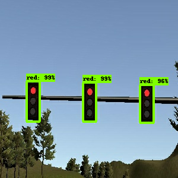
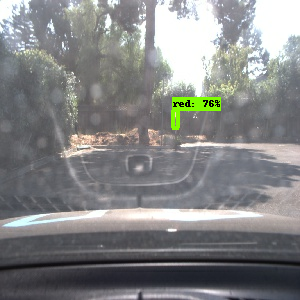

# Team AVS

Team Member | Udacity Account Eamil
----------- | ---------------------
Mate Bartalos | bartmate@gmail.com
Maurizio Pinto | maurizio.pinto@gmail.com
Sampath Vanimisetti | sampath.vanimisetti@gmail.com
Florian Wulff | florian.wulff@web.de
Victor Costa | vfcosta@gmail.com

# Short Description about our Solution

## Waypoint Updater (WPU)

### Topics WPU is subscribed to

Topic Name | Description
---------- | -----------
/vehicle/dbw_enabled | Getting the information if DBW is switched on or off
/base_waypoints | Getting the waypoint list
/current_pose | Getting the current position of the car
/current_velocity | Getting the current velocity of the car
/traffic_waypoints | Getting the waypoint of the next Stop Line if the corresponding Traffic Light is red or yellow
/obstacle_waypoints | Getting the waypoint of the next obstacle (Not used)

### Topics WPU publishes into

Topic Name | Description
---------- | -----------
/final_waypoints | Publishing the velocity values for each waypoints (in certain horizon)

### Summary on how WPU works

The WPU is basically a finitive state automaton with 4 states.

State | Description | Possible Next States
----- | ----------- | ------------------
Start of Acceleration | In this state it is planned how the car will accelerate until reaching the target speed. The extent of the acceleration is hard wired. This is the start state. | Acceleration, Start of Deceleration
Acceleration | In this state the acceleration plan is followed. If the target speed is reached, it is kept further. | Acceleration, Start of Deceleration
Start of Deceleration | In this state it is planned how the car will decelerate until reaching the Stop Line. The deceleration rate is between a hard wired minimum and maximum deceleration rate. | Deceleration, Start of Acceleration
Deceleration | In this state the deceleration plan is followed. If the zero speed is reached, it is kept further. | Deceleration, Start of Acceleration

In case of acceleration (i.e. states Start of Acceleration and Acceleration) it is checked if there is a red or yellow Traffic Light in a distance for which the car should decelerate between a hard wired minimum and maximum deceleration rate. If yes, the state goes to Start of Deceleration. This logic ensures two important things:
* When the Traffic Light changes from green to yellow/red, the car will not stop if it is not safe to do so (i.e. the deceleration rate would be too high).
* When a red Traffic Light is too far away, the car will not decelerate very slowly, instead it goes on (maybe the Traffic Light will change to green), and brakes only if the Traffic Light is close enough.

In case of deceleration (i.e. states Start of Deceleration and Deceleration) it is checked if the next Traffic Light changed to green. If yes, the state goes to Start of Acceleration.

### Other remarks

The jerk-minimizing formula was not used, because the controller in DBW smoothes the speed values, so the jerk does not approach the critical level.

## DBW - drive-by-wire component

### Parameters used by DBW

* '*vehicle_mass*' : vehicle mass
* '*wheel_base*': wheel base
* '*wheel_radius*' : wheel radius
* '*min_speed*': minimum cruise speed
* '*max_speed*': maximum cruise speed
* '*max_lat_accel*' : maximum lateral acceleration
* '*max_steer_angle*' : maximum steer angle
* '*steer_ratio*': steer ratio
* '*decel_limit*': deceleration limit (used for braking)
* '*accel_limit*' : acceleration limit
* '*brake_deadband*' : brake deadband

### Responsibilities of DBW node

1. Subscribe to the relevant topics: */twist_cmd*, */current_velocity*, */vehicle/dbw_enabled*, */final_waypoints*, *current_pose*, */vehicle/steering_report*
2. Instantiate a twist controller
3. Use, in a loop, the twist controller to obtain and publish **throttle**, **steering**, and **brake** values
						  
### Responsibilities of the Twist Controller

1. Instantiate a YawController with the following args: *wheel base*, *steering ratio*, *min speed*, *max lateral acceleration*, *max steering angle*
2. Instantiate a PID controller for the throttle
3. Instantiate two PID controllers for the steering (one based on the angles, one based on the CTE)
4. Instantiate a LowPass filter to smooth the steering PID controller response
5. In the control loop, use yaw controller and PIDs to determine target **throttle**, **steering**, and **brake** values
6. In case DBW is disabled return null values for throttle, brake, and steering, and reset the PID controllers

## Traffic Light Detection

We used the [Object Detection API from TensorFlow](https://github.com/tensorflow/models/tree/master/research/object_detection) as the main tool for detection and classification of traffic lights.

[Single Shot MultiBox Detector (SSD)](https://arxiv.org/abs/1512.02325) was the method used to detect and classify traffic lights: SSD is fast and seems to be a good fit for the task. We had also tried other approaches but our solution using SSD proved to be a good balance between performance and accuracy.

We created our own dataset based on images taken from the simulator and from bag files provided for this project.
Although small,  the dataset used for training proved to be enough to reach a satisfactory accuracy for the simulator and for the real execution (tested with bag files).
To address performance issues, we resized images in the dataset to 300x300. Thus, the detector was able to identify traffic lights with good performance without hurting accuracy. See [this file](https://github.com/team-avs/SystemIntegration/blob/master/ros/src/tl_detector/light_classification/model/ssd_mobilenet_v1_coco_real.config) for the model used by us to train our solution. 

See below some classification examples.

